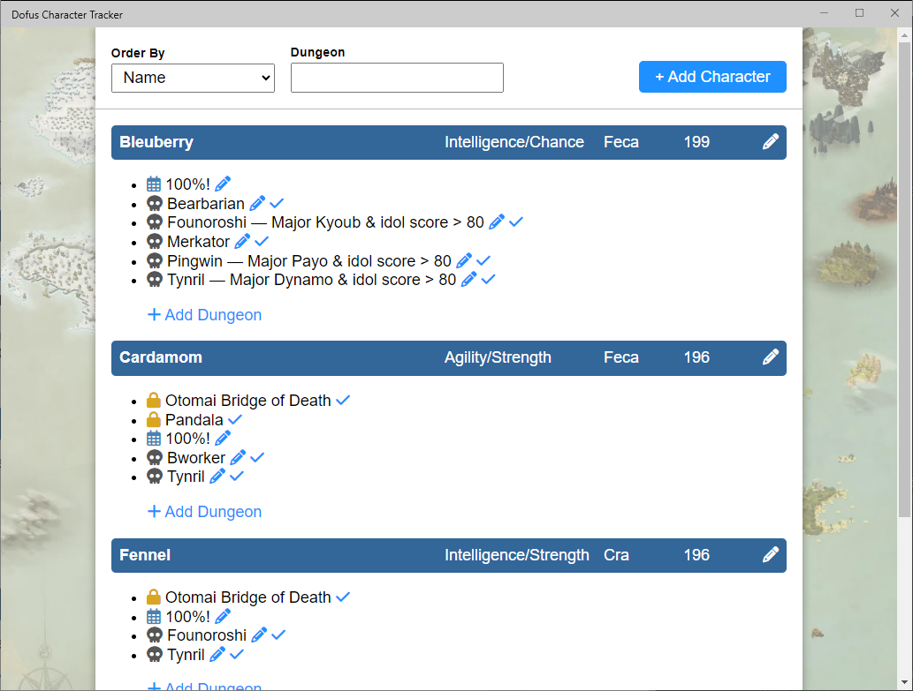

## What Is It?

Doofus Character Tracker is a desktop application that helps you track your Dofus characters' progress.

It was made very much for me, and how I play Dofus, but hey: it's an open-source project with a super-permissive license! Feel free to make changes!

